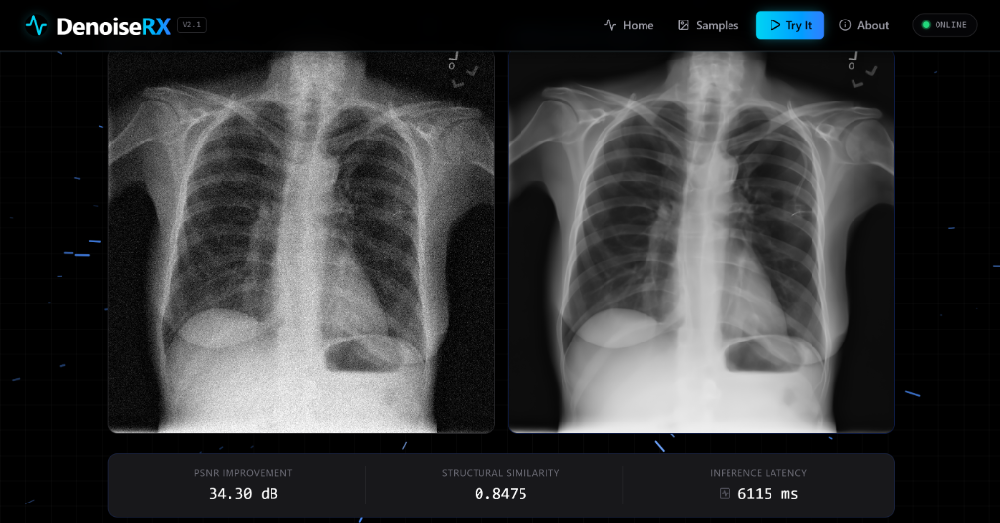
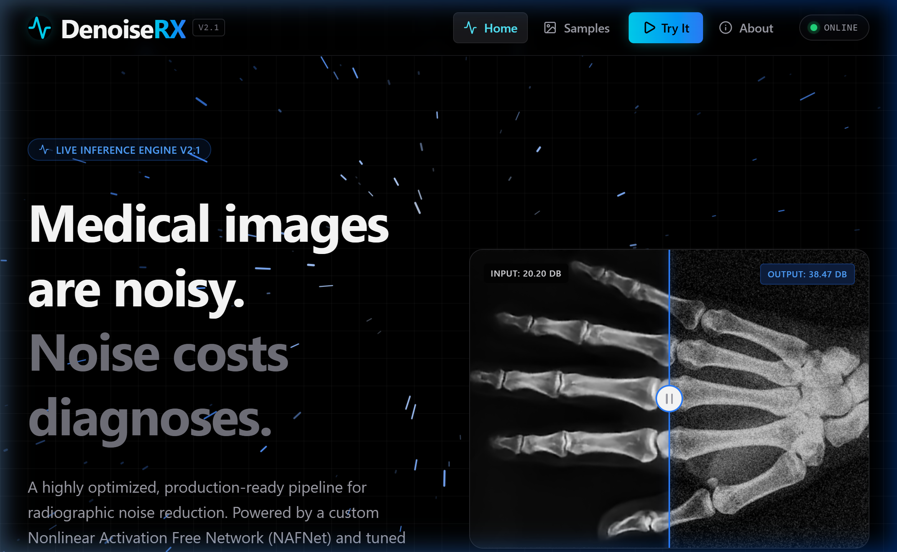

<div align="center">

# 🩺 DenoiseRX

### **Clinical Chest X-Ray Denoising & Radiograph Restoration Engine**

[](https://www.python.org/)
[](https://pytorch.org/)
[](https://fastapi.tiangolo.com/)
[](https://react.dev/)
[](https://www.docker.com/)
[](https://opensource.org/licenses/MIT)
[](https://github.com/pranav-kalra22/DenoiseRX-Medical-Denoising/actions/workflows/ci.yml)

**A lightweight, deep learning-powered medical imaging platform engineered to restore low-dose, high-noise chest radiographs using a Nonlinear Activation-Free Network (NAFNet).**

---

### 🌟 Key Performance Benchmarks

| Metric | Baseline (Noisy Input, $\sigma=25$) | DenoiseRX (NAFNet L1 Best) | Net Improvement |
| :--- | :---: | :---: | :---: |
| **Peak Signal-to-Noise Ratio (PSNR)** | ~20.17 dB | **38.47 dB** | **+18.30 dB** |
| **Structural Similarity Index (SSIM)** | ~0.4820 | **0.9251** | **+0.4431** |
| **Trainable Parameters** | — | **2,941,889 (2.94M)** | Compact footprint |
| **Model Checkpoint Size** | — | **11.22 MB** | Edge & CPU ready |
| **Training Scale** | — | **8,000 NIH Chest X-rays** | 7,000 Train / 1,000 Val |

<br/>

<div align="center">
  
  <p><em>Figure 1: Interactive radiograph restoration interface with real-time split-slider and quantitative metrics.</em></p>
</div>

</div>

---

## 📌 Table of Contents
- [The Clinical Challenge](#-the-clinical-challenge)
- [Why DenoiseRX?](#-why-denoiserx)
- [Architecture & Algorithmic Innovations](#-architecture--algorithmic-innovations)
- [Empirical Loss Function Ablation](#-empirical-loss-function-ablation)
- [System Architecture](#-system-architecture)
- [Project Structure](#-project-structure)
- [Quick Start Guide](#-quick-start-guide)
  - [Prerequisites](#prerequisites)
  - [Method 1: Docker Compose (Recommended)](#method-1-docker-compose-recommended)
  - [Method 2: Manual Local Setup](#method-2-manual-local-setup)
- [REST API Reference](#-rest-api-reference)
- [Testing & Verification](#-testing--verification)
- [Documentation & Study Guides](#-documentation--study-guides)
- [License](#-license)

---

## 🏥 The Clinical Challenge

In diagnostic thoracic imaging, clinicians must balance the **ALARA** principle (*As Low As Reasonably Achievable*) to minimize patient radiation exposure. However, low radiation dosages introduce severe **Poisson-Gaussian quantum mottle** (quantum noise). 

This stochastic degradation:
1. Obscures faint, high-frequency diagnostic landmarks such as micro-nodules, hairline rib fractures, and subtle pneumothorax pleural lines.
2. Degrades radiologist reading confidence and increases triage diagnostic turnaround times.
3. Traditional denoising filters (Gaussian blur, bilateral, median filtering) inadvertently smooth out sharp trabecular bone edges.
4. Heavy Vision Transformers (ViTs) and standard 60M+ parameter CNNs impose severe computational and memory bottlenecks impractical for commodity hospital PACS workstations.

---

## ⚡ Why DenoiseRX?

DenoiseRX delivers **high-fidelity anatomical restoration** under an **ultra-compact parameter budget**:

- **Lightweight Parameter Footprint:** Scaled-down NAFNet with only **2.94M parameters (11.2 MB)**, allowing deployment on standard CPU servers or edge diagnostic terminals.
- **Zero Nonlinear Activation Overhead:** Implements **SimpleGate**, replacing compute-heavy transcendental activations (GELU, ReLU, Sigmoid) with simple channel-chunking and element-wise multiplication.
- **Arbitrary Resolution Handling:** Robust preprocessing with **symmetric reflection padding to exact multiples of 16** ($2^4$ downsampling alignment), preventing U-Net skip-connection tensor shape mismatches.
- **Production-Ready Microservices:** Asynchronous background job polling with FastAPI, UUID task tracking, Docker containerization, and an interactive React split-slider interface.

---

## 🧠 Architecture & Algorithmic Innovations

DenoiseRX utilizes a tailored **NAFNet (Nonlinear Activation-Free Network; ECCV 2022)** adapted specifically for single-channel medical radiographs.

```
Incoming Radiograph [1, H, W]
          │
  [Reflection Pad to 16n] ──► [Input Conv: 1 -> 16]
                                      │
                         ┌────────────┴────────────┐
                         ▼                         ▼
                  [Encoder Level 1] (16ch)    [Skip L1] ──┐
                         │                                 │
                  [Encoder Level 2] (32ch)    [Skip L2] ─┐ │
                         │                               │ │
                  [Encoder Level 3] (64ch)    [Skip L3] ┐│ │
                         │                              ││ │
                  [Encoder Level 4] (128ch)             ││ │
                         │                              ││ │
                  [Middle Blocks] (128ch)               ││ │
                         │                              ││ │
                  [Decoder Level 4] (64ch)  ◄── Concatenate
                         │                              ││
                  [Decoder Level 3] (32ch)  ◄── Concatenate
                         │                               │
                  [Decoder Level 2] (16ch)  ◄── Concatenate
                         │
                  [Decoder Level 1] (16ch)
                         │
                  [Output Conv: 16 -> 1] + Residual Skip
                         │
               [Center Crop to (H, W)]
                         │
              Denoised Output [1, H, W]
```

### 1. SimpleGate Non-Linearity
Standard activations require expensive floating-point transcendental approximations. SimpleGate achieves non-linear feature transformation simply by splitting channel dimensions and computing an element-wise product:
$$\text{SimpleGate}(X) = X_1 \odot X_2, \quad \text{where } X = [X_1, X_2] \in \mathbb{R}^{2C \times H \times W}$$

### 2. Simplified Channel Attention (SCA)
Instead of standard SE-Net blocks requiring channel squeeze-excitation with Sigmoids, SCA aggregates global spatial context via Global Average Pooling followed by a linear $1\times 1$ convolution:
$$\text{SCA}(X) = X \odot \text{Conv}_{1\times 1}(\text{GAP}(X))$$

### 3. Divisibility Rule of 16 ($2^4$)
NAFNet contains 4 hierarchical downsampling stages. Any spatial dimension not divisible by $2^4 = 16$ causes fractional rounding during downsampling, crashing skip-connection concatenation. DenoiseRX enforces:
```python
def pad_to_multiple(img_tensor, multiple=16):
    h, w = img_tensor.shape[-2:]
    pad_h = (multiple - (h % multiple)) % multiple
    pad_w = (multiple - (w % multiple)) % multiple
    # Symmetric reflection padding prevents black border artifacts
    return F.pad(img_tensor, (0, pad_w, 0, pad_h), mode='reflect')
```

---

## 🔬 Empirical Loss Function Ablation

During training on 8,000 NIH chest X-rays (7,000 train / 1,000 validation) using the AdamW optimizer with Cosine Annealing learning rate decay ($1\times 10^{-3} \to 1\times 10^{-6}$), we conducted a loss function ablation study:

```
+----------------------------------------------------------------------------------------+
| Model Variant             | Loss Formulation           | Val PSNR (dB) | Val SSIM      |
+----------------------------------------------------------------------------------------+
| Baseline (Noisy Input)    | AWGN (sigma = 25)          | ~20.17 dB     | ~0.4820       |
| NAFNet (L1 + SSIM)        | L1 + lambda * (1 - SSIM)   | 38.37 dB      | 0.9246        |
| NAFNet (Pure L1) [BEST]   | Mean Absolute Error (|y-x|)| 38.47 dB      | 0.9251        |
+----------------------------------------------------------------------------------------+
```

### 💡 Key Takeaway: Why Pure L1 Outperforms L1 + SSIM
In natural RGB computer vision, composite SSIM loss often sharpens macroscopic textures. However, on **single-channel grayscale radiographs**:
- Fine diagnostic features (e.g., rib trabeculae, vascular branching) introduce sharp local gradients.
- SSIM computes mean, variance, and covariance over local sliding Gaussian windows ($11\times 11$).
- When co-optimized with pointwise L1 loss, the sliding-window derivative creates **gradient conflicts** on high-frequency edges, trapping the optimizer in a local sub-optimum.
- **Pure L1 provides a smooth, convex optimization surface**, yielding higher numerical convergence (+0.10 dB PSNR) and cleaner anatomical preservation.

---

## 🏗️ System Architecture

DenoiseRX is architected as an asynchronous, decoupled microservice stack:

```
[ Clinical User / Web Client ]
              │
      HTTP / REST (Vite)
              ▼
[ React 18 Frontend ] (Port 5173)
  ├── Drag & Drop Radiograph Ingestion
  ├── HTML5 Canvas Real-Time Split Slider
  └── Asynchronous Job Status Poller
              │
      REST API Polling (/denoise/process -> /job/{id})
              ▼
[ FastAPI Backend ] (Port 8000)
  ├── Dynamic Min-Max [0, 1] Tensor Normalization
  ├── 16-Pixel Symmetric Reflection Padding
  ├── PyTorch NAFNet Inference Engine (CPU/CUDA auto-detect)
  └── In-Memory Background Job Execution Cache
```

<div align="center">
  
  <p><em>Figure 2: DenoiseRX web platform landing overview and architecture showcase.</em></p>
</div>

---

## 📂 Project Structure

```bash
DenoiseRX-main/
├── backend/
│   ├── main.py               # FastAPI server, REST routes & job workers
│   ├── model.py              # PyTorch NAFNet, SimpleGate & SCA architecture
│   ├── requirements.txt      # Python dependencies (torch, torchvision, fastapi, etc.)
│   ├── Dockerfile            # Backend container definition
│   ├── tests/
│   │   └── test_api.py       # PyTest suite (5/5 unit & integration tests)
│   └── weights/
│       ├── README.md         # Instructions for weights placement
│       └── nafnet_l1_best_psnr.pth  # Trained model weights (11.2 MB)
├── frontend/
│   ├── src/
│   │   ├── components/       # UI components (Header, Viewer, Slider, CaseSelector)
│   │   ├── pages/            # LandingPage & InferencePage
│   │   ├── api/              # Axios API service client
│   │   ├── App.jsx           # Root React router
│   │   └── index.css         # Modern dark-mode styling
│   ├── public/samples/       # Pre-loaded clinical test cases (Case 01 - 04)
│   ├── package.json          # Node dependencies (React 18, Lucide, Tailwind)
│   └── Dockerfile            # Frontend container definition
├── docs/
│   ├── Beginner_Friendly_DenoiseRX.pdf   # 11-page child-to-senior guide
│   └── Resume_Prep_DenoiseRX.pdf        # 17-page 18-part interview prep guide
├── docker-compose.yml        # Multi-container orchestration
├── .gitignore                # Git exclusions
└── README.md                 # Project documentation
```

---

## 🚀 Quick Start Guide

### Prerequisites
- [Docker Desktop](https://www.docker.com/products/docker-desktop/) (recommended) **OR**
- Python 3.10+ and Node.js 18+ for manual setup.

---

### Method 1: Docker Compose (Recommended)

Clone the repository and spin up the complete microservice stack with a single command:

```bash
# 1. Clone the repository
git clone https://github.com/YOUR_USERNAME/DenoiseRX.git
cd DenoiseRX

# 2. Launch the backend and frontend services
docker compose up --build
```

Once built, navigate to:
- **Web User Interface:** `http://localhost:5173`
- **FastAPI Interactive Docs (Swagger):** `http://localhost:8000/docs`
- **Backend Health Check:** `http://localhost:8000/health`

---

### Method 2: Manual Local Setup

#### 1. Backend Setup
```bash
cd backend
python -m venv venv

# On Windows:
.\venv\Scripts\activate
# On Linux/macOS:
# source venv/bin/activate

pip install -r requirements.txt
uvicorn main:app --host 0.0.0.0 --port 8000 --reload
```

#### 2. Frontend Setup
```bash
cd ../frontend
npm install
npm run dev
```
Open `http://localhost:5173` in your browser.

---

## 🔌 REST API Reference

### 1. Health Check
`GET /health`
```json
{
  "status": "healthy",
  "device": "cpu",
  "weights_loaded": true,
  "model_parameters": 2941889
}
```

### 2. Submit Radiograph for Denoising
`POST /denoise/process` (Multipart Form-Data)
* **Parameters:** `file` (image/png or image/jpeg), `sigma` (optional float, default: `25.0`)
```json
{
  "job_id": "8f32c91a-b32e-4361-9c87-6e01a8df9e42",
  "status": "queued",
  "message": "Image queued for denoising"
}
```

### 3. Poll Job Status & Retrieve Result
`GET /job/{job_id}`
```json
{
  "job_id": "8f32c91a-b32e-4361-9c87-6e01a8df9e42",
  "status": "completed",
  "metrics": {
    "psnr": 38.47,
    "ssim": 0.9251,
    "latency_ms": 1420
  },
  "original_image": "data:image/png;base64,...",
  "denoised_image": "data:image/png;base64,..."
}
```

---

## 🧪 Testing & Verification

DenoiseRX includes a comprehensive test suite in PyTest validating endpoint contracts, reflection padding boundaries, and inference pipelines:

```bash
# Run tests inside backend directory
pytest tests/ -v
```

**Test Coverage:**
- `test_health_check`: Validates system status and parameter loading.
- `test_reflection_padding`: Verifies arbitrary dimensions ($H \times W$) pad to exact multiples of 16.
- `test_invalid_file_upload`: Ensures HTTP 400 rejection on non-image payloads.
- `test_end_to_end_denoise_job`: Simulates job submission, status transitions, and base64 output decoding.

---

## 📚 Documentation & Study Guides

Comprehensive documentation files are available in the `docs/` folder:
- 📖 [**Beginner_Friendly_DenoiseRX.pdf**](docs/Beginner_Friendly_DenoiseRX.pdf): Explains the entire pipeline from child level to senior developer level with diagrams and analogies.
- 🎓 [**Resume_Prep_DenoiseRX.pdf**](docs/Resume_Prep_DenoiseRX.pdf): 18-part senior engineering interview prep guide covering loss dynamics, trade-offs, architecture, and live defense questions.

---

## 📜 License

This project is licensed under the MIT License — see the [LICENSE](LICENSE) file for details.

---

## 📖 References & Acknowledgments

* **NAFNet:** Chen, L., Lu, X., Zhang, J., Chu, X., & Chen, C. (2022). *Simple Baselines for Image Restoration*. In European Conference on Computer Vision (ECCV 2022).
* **Dataset:** NIH Clinical Center. *ChestX-ray14: Hospital-scale Chest X-ray Database and Benchmarks on Weakly-Supervised Classification and Localization of Common Thorax Diseases*.
